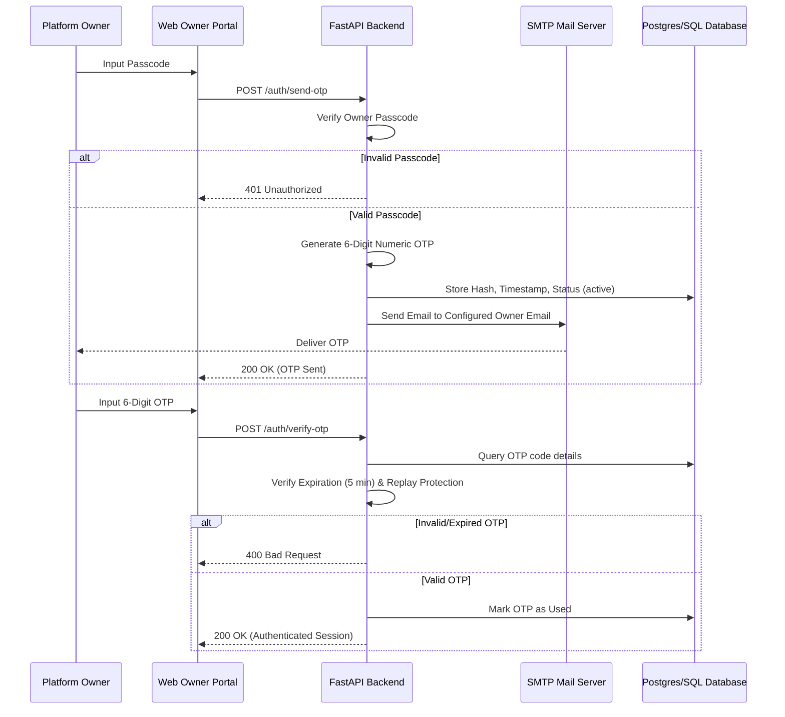

# LeadLens Security Practices & Architecture Documentation

LeadLens implements a **zero-trust security model**. Under this architecture, **no endpoint, data query, or system resource serves a single line of data without explicit authentication and authorization validation**.

---

## 1. Core Authentication Model (JWT)

Every request to secure API endpoints must include a valid JSON Web Token (JWT) in the `Authorization` header as a Bearer token:
`Authorization: Bearer <JWT_TOKEN>`

### Token Generation & Lifecycle
* **Hashing Context**: User passwords are encrypted using `Bcrypt` with passlib contexts (`CryptContext`) before database storage. Raw passwords are never stored or logged.
* **Token Signatures**: JWTs are cryptographically signed using `HS256` (`JWT_ALGORITHM`) with a cryptographically secure server secret key (`JWT_SECRET_KEY`) loaded via environment variables.
* **Token Expiration**: Access tokens are configured with a strict expiration window (default: 60 minutes) to minimize token exposure risks.

### Dependency Injection Enforcement
Every secure route depends on the `get_current_user` dependency:
1. Decodes and verifies the signature of the incoming JWT.
2. Extracts the unique user identifier (`sub`) and role metadata.
3. Queries the database to verify the user exists and is active.
4. If validation fails at any point, raises a `401 Unauthorized` HTTP exception immediately.

---

## 2. Role-Based Access Control (RBAC)

LeadLens enforces clear segregation of duties and permissions using standard RBAC. Endpoints utilize a dynamic `RoleChecker` dependency to restrict access.

| Role | Permissions & Scope | Code Enforcement Example |
| :--- | :--- | :--- |
| **Super Admin** | Full access to an organization's resources, billing, user management, and call analytics. | `Depends(RoleChecker(["super-admin"]))` |
| **Admin** | Manages user registration approvals and views team analytics. | `Depends(RoleChecker(["super-admin", "admin"]))` |
| **Group Leader** | Monitors the call logs and analytics of assigned Warriors. | `Depends(RoleChecker(["super-admin", "admin", "group-leader"]))` |
| **Warrior** | Accesses mobile app call logging client and uploads logs. | `Depends(RoleChecker(["super-admin", "admin", "group-leader", "warrior"]))` |

---

## 3. Platform Owner Portal & 2-Factor Authentication (2FA)

Organization provisioning and Super Admin creation are isolated in the **Owner Portal**. This administration layer is protected by multi-stage security checks:

### 2FA Verification Safeguards
* **Expiration**: Generated OTPs are valid for exactly **5 minutes**. Any attempt to verify after this period is rejected.
* **Replay Protection**: Once verified, the OTP state is marked as `used=True` in the database, preventing reuse.
* **SMTP Delivery**: Access codes and invitation keys are dispatched solely via secure SMTP connections to the owner's pre-configured contact address.

---

## 4. Database & Infrastructure Security

* **Environment Separation**: Sensitive credentials (database connection strings, JWT secret keys, SMTP passwords) are loaded dynamically from environment files (`.env`) and are never committed to source control.
* **SQL Injection Prevention**: Database access is fully managed through SQLAlchemy ORM, ensuring all inputs are automatically parameterized.
* **Self-Registration Isolation**: Call Tracking Warriors cannot self-register without a valid Organization Invite Code pre-generated during administrative provisioning.
